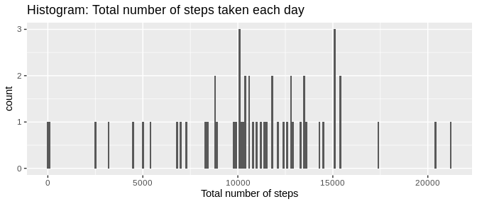
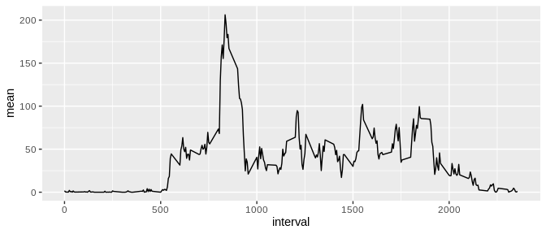
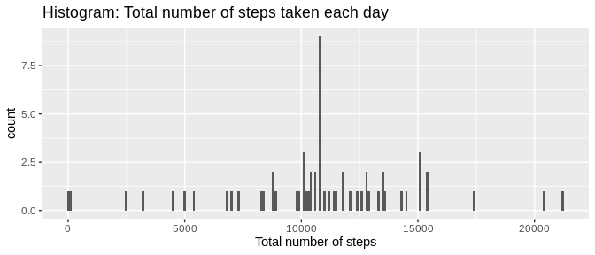

## Loading and preprocessing the data

```r
unzip("activity.zip")
myData <- read.csv("activity.csv")
```

## What is mean total number of steps taken per day?

```r
stepsPerDay <- myData %>% 
    group_by(date) %>% 
    mutate(total = sum(steps)) %>% 
    select(date, total) %>% 
    unique()
meanStepsPerDay <- round(mean(stepsPerDay$total, na.rm = T))
medianStepsPerDay <- round(median(stepsPerDay$total, na.rm = T))

ggplot(data = stepsPerDay, aes(stepsPerDay$total)) + 
    geom_histogram(binwidth = 100) +
    labs(title = "Histogram: Total number of steps taken each day",
         x = "Total number of steps") 
```

<!-- -->

The mean total number of steps taken per day is 10766 and the median total number of steps taken per day is 10765.

## What is the average daily activity pattern?

```r
myDataIntervalMean <- myData %>% 
    filter(steps != "NA") %>% 
    group_by(interval) %>% 
    mutate(mean = mean(steps)) %>% 
    select(interval, mean) %>% 
    unique()

intervalMax <- myDataIntervalMean$interval[which(myDataIntervalMean$mean == max(myDataIntervalMean$mean))]

ggplot(data = myDataIntervalMean, aes(x = interval, y = mean)) + 
    geom_line()
```

<!-- -->

The 5-minute interval 835, on average across all the days in the dataset, contains the maximum number of steps.

## Imputing missing values

There are 2304 missing values in the dataset.

**Fill in missing data**

```r
myDataComplete <- myData
for(idx in 1:nrow(myData)){
    if(is.na(myData$steps[idx])){
        # if NA then substitute with mean value of corresponding interval
        thisInterval <- myData$interval[idx]
        myDataComplete$steps[idx] <- myDataIntervalMean$mean[myDataIntervalMean$interval == myData$interval[idx]]
    }
}
```

**histogram**

```r
stepsPerDayComplete <- myDataComplete %>% 
    group_by(date) %>% 
    mutate(total = sum(steps)) %>% 
    select(date, total) %>% 
    unique()
meanStepsPerDayComplete <- round(mean(stepsPerDayComplete$total, na.rm = T))
medianStepsPerDayComplete <- round(median(stepsPerDayComplete$total, na.rm = T))

ggplot(data = stepsPerDayComplete, aes(stepsPerDayComplete$total)) + 
    geom_histogram(binwidth = 100) +
    labs(title = "Histogram: Total number of steps taken each day",
         x = "Total number of steps") 
```

<!-- -->

The mean total number of steps taken per day is 10766 and the median total number of steps taken per day is 10766.

## Are there differences in activity patterns between weekdays and weekends?
